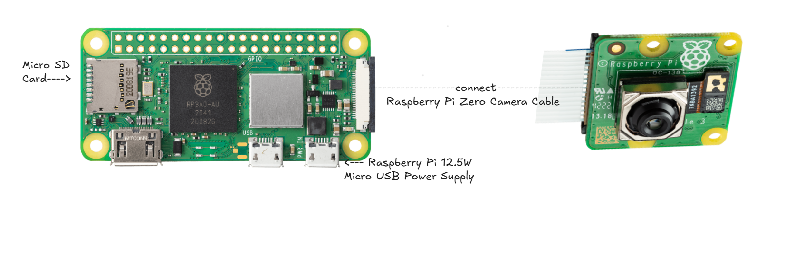

# LaserPointerMouse

LaserPointerMouse is a project that uses a **Raspberry Pi Zero 2 W** and a **Raspberry Pi Camera Module 3** to track a laser pointer and use its position as mouse input.

The camera detects the laser point, and the Raspberry Pi processes the camera image to determine its position.

## Why I Made This

I wanted to make a project where I could control a computer using a laser pointer instead of a normal mouse.

I also wanted to learn more about Raspberry Pi, computer vision, camera processing, and designing a custom case for hardware.

## How It Works

The Raspberry Pi Camera Module 3 captures video of the area where the laser pointer is being used.

The Raspberry Pi Zero 2 W processes the camera image and detects the bright laser point.

The detected position is converted into coordinates that can be used to control the mouse cursor.

Basic process:

**Laser Pointer → Camera → Raspberry Pi Zero 2 W → Image Processing → Mouse Movement**

## Hardware

* Raspberry Pi Zero 2 W
* Raspberry Pi Camera Module 3
* Raspberry Pi camera cable
* 5V power supply
* Custom 3D printed case

## Hardware Connections

The hardware connection is simple because the camera connects directly to the Raspberry Pi.

**Camera Module 3 → Camera Cable → Raspberry Pi Zero 2 W Camera Connector**

The Raspberry Pi Zero 2 W receives power through its USB power port.

No external breadboard circuit is required for the main system.

## CAD

I designed the enclosure for LaserPointerMouse using **Tinkercad**.

The case is designed to hold and protect the Raspberry Pi Zero 2 W and camera while keeping the camera positioned correctly.

The CAD files are included in this repository.

## Software

The final software is designed to run on the Raspberry Pi Zero 2 W with the Raspberry Pi Camera Module 3.

Since I do not have the Raspberry Pi hardware yet, I am currently developing and testing the software on a Windows laptop using its built-in webcam.

The current Python prototype can:

* Capture live video from the webcam
* Detect a green laser point using OpenCV
* Calculate the laser position as `(x, y)` coordinates
* Convert camera coordinates into screen coordinates
* Control the Windows mouse cursor
* Smooth the cursor movement and reduce small unwanted movements
* Calibrate four points of the target area
* Use perspective transformation to improve coordinate accuracy

The software is separated into:

* `main.py` — runs the main program
* `laser_detector.py` — detects the green laser point
* `coordinate_mapper.py` — handles calibration and coordinate mapping
* `mouse_controller.py` — handles smoothing and mouse movement

The current prototype uses:

**Laptop Webcam → Python + OpenCV → Green Laser Detection → Coordinate Mapping → Windows Mouse**

After I receive the hardware, I will replace the laptop webcam with the Raspberry Pi Camera Module 3 and run the software on the Raspberry Pi Zero 2 W.

The final goal is:

**Pi Camera → Raspberry Pi Zero 2 W → Laser Detection → Coordinate Mapping → USB HID Mouse → Windows**

## Wiring Diagram

* Since this project does not use external pins such as GPIO, there is no circuit diagram, so it has been replaced with a photo of the structure diagram.

The wiring diagram shows the connection between:

**Raspberry Pi Camera Module 3 → Camera Cable → Raspberry Pi Zero 2 W → 5V Power**

## BOM

📦 Bill of Materials (BOM)

| Item | Qty | Price (USD) | Item Link | Notes |
|---|---:|---:|---|---|
| Laser Pointer | 1 | $56.00 | [Link](https://laserclassroom.com/products/classroom-green-laser-pointer) | Already owned – not requesting funding. Required to use the project. |
| Raspberry Pi Zero 2 W | 1 | $17.25 | [Link](https://www.pishop.us/product/raspberry-pi-zero-2-w/?src=raspberrypi) | It is the brain of this project. |
| Raspberry Pi Camera Module 3 | 1 | $26.95 | [Link](https://www.canakit.com/raspberry-pi-camera-module-3.html?cid=usd&src=raspberrypi) | |
| Raspberry Pi Zero Camera Cable | 1 | $5.95 | [Link](https://www.canakit.com/raspberry-pi-zero-camera-cable.html) | |
| Raspberry Pi MicroSD Card | 1 | $24.95 | [Link](https://www.canakit.com/raspberry-pi-micro-sd-card.html?cid=USD&src=raspberrypi) | |
| Raspberry Pi 3 / Zero Power Supply (Micro USB) | 1 | $8.00 | [Link](https://www.canakit.com/raspberry-pi-3-zero-power-supply-micro-usb.html?cid=usd&src=raspberrypi) | |
| 3D Printed Enclosure – custom designed | 1 | $21.12 | [Craftcloud 3D](https://craftcloud3d.com/en/upload) | FDM, PLA, black. Estimated price: $21.12 USD. |

**Total Price: $160.22 USD**

## What I Learned

Through this project, I learned more about:

* Raspberry Pi hardware
* Raspberry Pi camera connections
* Computer vision and image processing
* Connecting software with physical hardware
* Designing a case in Tinkercad
* 3D printing and CAD

## Future Improvements

Some possible improvements are:

* Improve laser detection accuracy
* Reduce cursor movement delay
* Improve calibration
* Make the enclosure smaller and cleaner
* Improve camera mounting
* Add more mouse controls and gestures

## Project Files

The repository includes the source code, CAD files, wiring diagram, and other files needed to understand and reproduce the project.
